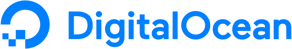
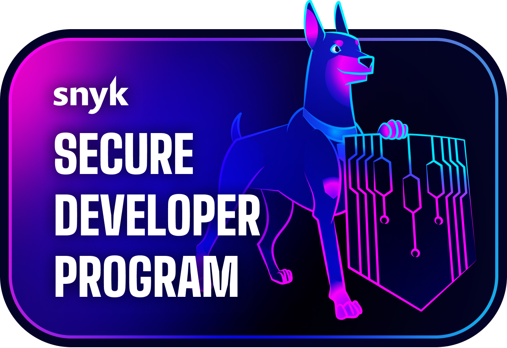

**Open‑source collaboration platform for InfoSec professionals**  
Plan, automate, execute and report on pentest and vulnerability assessment engagements — from reconnaissance to final report — with speed, precision and teamwork.

Reconmap is an open-source platform designed to support security teams throughout the engagement lifecycle:

- **Centralised project and task management** for clients, scopes and assessments
- **Command automation**: execute shell or custom modules on demand or on schedule
- **Auto‑capture of outputs** and vulnerability tracking
- **Professional report generation**: export as Word, Markdown or LaTeX
- **Rich analytics**, dashboards and integrations across the toolchain
- [Many more features...](https://reconmap.com/overview/features/)

## Why Reconmap?

- **Streamlined workflows**: from planning to reporting in a few clicks
- **Enhanced collaboration**: keep everyone on the same page
- **Automated reporting**: cut down admin burden, focus on analysis
- **Adaptable & extensible**: integrate with your stack and tooling

## Try it now

- **Demo**: experience Reconmap on our [live instance](https://reconmap.com/overview/live-demo/)
- **Hosted SaaS**: let us handle hosting via [Netfoe](https://netfoe.com)

## Documentation

Visit [reconmap.com](https://reconmap.com) for the complete documentation.

## 🤝 Contribute & Collaborate

Reconmap is community-driven, your help makes it better! Here's how to get involved:

- **Star the project** ⭐ to follow updates and spread the word with others
- Improve the documentation (user, admin, developer manuals)
- Suggest or develop new features
- [Report issues](https://github.com/reconmap/reconmap/issues) or vulnerabilities
- [Join discussions](https://github.com/orgs/reconmap/discussions/categories/general)

**Please review our [Contributing Guidelines](https://github.com/reconmap/reconmap?tab=coc-ov-file#readme) before getting started.**

## Licence & Policies

- **License**: Apache‑2.0
- **[Code of Conduct](https://github.com/reconmap/reconmap?tab=coc-ov-file#readme)** and **[Security Policy](https://github.com/reconmap/reconmap?tab=security-ov-file#readme)**

## 📬 Stay in Touch

- Use the [discussions](https://github.com/orgs/reconmap/discussions) tab to participate in conversations
- Report bugs or request features in the **Issues** tab

## Sponsors and supporters

  
   
  

